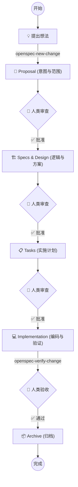

# OpenSpec Drive 🚀

> **Plan-First, Spec-Driven Development Workflow for AI Coding Assistants**

MySpecDrive 是自用的 **Trae IDE**  AI 辅助编程工作流。它通过强制执行 "Plan-First"（计划优先）原则和 "Human-in-the-Loop"（人类介入）机制，让 AI 开发者不再“盲目编码”，而是像资深工程师一样思考、设计、验证。

## 🌟 核心理念 (Core Philosophy)

在 AI 辅助编程中，我们常遇到以下问题：
- ❌ AI 一上来就写代码，逻辑漏洞百出。
- ❌ 缺乏全局视野，改了这里坏了那里。
- ❌ 难以进行有效的 Code Review，因为意图不明确。

**OpenSpec Drive** 通过以下原则解决这些问题：

1.  **Plan-First (计划优先)**: 在编写任何代码之前，必须先产出 Proposal（提案）、Specs（规格）、Design（设计）和 Tasks（任务）。
2.  **Human-in-the-Loop (人类介入)**: 在每个关键节点（Proposal -> Specs -> Design -> Implementation），AI 必须暂停并等待人类的审查与批准。
3.  **Artifact-Driven (工件驱动)**: 使用结构化的 Markdown 文档作为 AI 与人类沟通的桥梁，而非仅靠对话。

## 🛠️ 工作流 (The Workflow)

OpenSpec Drive 将开发过程划分为四个严格的阶段，每个阶段都由特定的工件（Artifacts）驱动：



### 关键工件 (Artifacts)

- **`proposal.md`**: **Why & What**. 定义变更的意图、背景和范围。
- **`specs/`**: **Requirements**. 系统的行为规范，Source of Truth。
- **`design.md`**: **How**. 技术方案、架构设计、接口定义。
- **`tasks.md`**: **Checklist**. 具体的实施步骤和测试计划。

## 🚀 快速开始 (Getting Started)

### 1. 安装 (Installation)

将本项目中的 `.trae/` 文件夹复制到你的 Trae 项目根目录下。

```bash
# 假设你在项目根目录
cp -r /path/to/OpenSpec-Drive/.trae .
```

### 2. 初始化 (Initialization)

确保你已经安装了 Trae IDE，并启用了 **Skill** 功能。

在 Trae 的聊天窗口中输入：

```
openspec-init
```

这将初始化 `openspec/` 目录结构和必要的配置文件。

### 3. 开始一个新变更 (Start a Change)

当你想要开发新功能或修复 Bug 时，不要直接让 AI 写代码，而是输入：

```
openspec-new-change
```

AI 将引导你创建 `proposal.md`，开启 OpenSpec 之旅。

## 🧰 内置技能 (Built-in Skills)

OpenSpec Drive 提供了一系列 Trae Skills 来自动化工作流：

| Skill Name | Description |
| :--- | :--- |
| `openspec-new-change` | 启动一个新的变更流程 (Proposal 阶段) |
| `openspec-continue-change` | 推进工作流到下一阶段 (Specs/Design/Tasks) |
| `openspec-apply-change` | 执行 `tasks.md` 中的实施计划 |
| `openspec-verify-change` | 验证实现是否符合 Specs 和 Tasks |
| `openspec-archive-change` | 完成并归档当前变更 |
| `git-smart-commit` | 智能生成 Conventional Commits 并处理推送 |
| `project-analyze` | 分析项目结构和技术栈 |

## 📜 规则与原则 (Rules)

本项目包含预设的 AI 行为准则 (`.trae/rules/`)：

- **Core-工程化原则**: 强调验证驱动、原子提交和网络健壮性。
- **母语原则**: 强制 AI 使用中文思考和文档编写（代码除外）。

## 🤝 贡献 (Contributing)

欢迎提交 Issue 或 PR 来改进 OpenSpec Drive 工作流！

## 📄 License

MIT License
