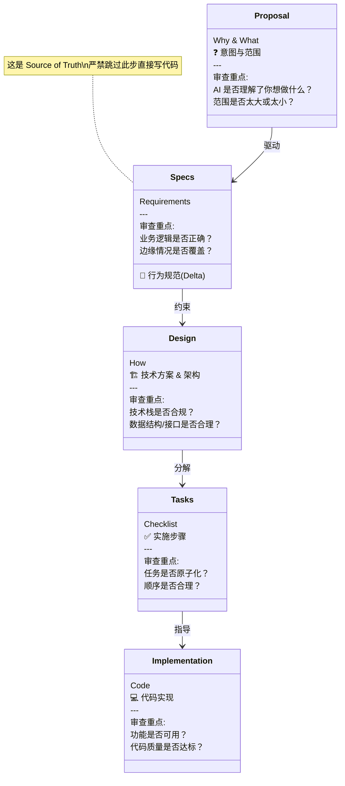
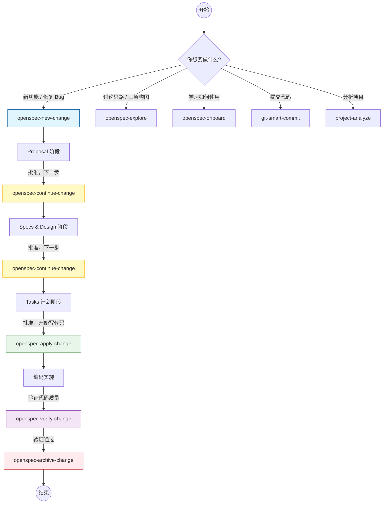

# OpenSpec Drive 🚀

[](https://github.com/Cooper-X-Oak/MySpecDrive_GUIDE)
[](https://github.com/fission-ai/openspec)

> **Plan-First, Spec-Driven Development Workflow for AI Coding Assistants**

MySpecDrive 是自用 **Trae IDE** 的 Spec-Driven Development (SDD) 工作流模板。它基于 **[OpenSpec](https://github.com/fission-ai/openspec)** 框架，通过强制执行 "Plan-First"（计划优先）原则和 "Human-in-the-Loop"（人类介入）机制，让 AI 开发者不再“盲目编码”。

希望给同样初学者的你提供学习和部署的便利。

> **🌍 通用性说明 (Universality)**:
> 虽然本项目采用了 Trae IDE 的 `.trae` 配置格式，但其核心的 **Rules (Markdown)** 和 **Skills (Prompts)** 逻辑是通用的。你可以轻松将其 Prompt 移植到 **Cursor** (.cursorrules), **Windsurf**, 或其他支持 System Prompt/Context 的 AI 编程环境中。OpenSpec 是一种方法论，而非仅限于某个工具。

## 🌟 核心理念 (Core Philosophy)

在 AI 辅助编程中，我们常遇到以下问题：
- ❌ AI 一上来就写代码，逻辑漏洞百出。
- ❌ 缺乏全局视野，改了这里坏了那里。
- ❌ 难以进行有效的 Code Review，因为意图不明确。

**OpenSpec Drive** 通过以下原则解决这些问题：

1.  **Plan-First (计划优先)**: 在编写任何代码之前，必须先产出 Proposal（提案）、Specs（规格）、Design（设计）和 Tasks（任务）。
2.  **Human-in-the-Loop (人类介入)**: 在每个关键节点（Proposal -> Specs -> Design -> Implementation），AI 必须暂停并等待人类的审查与批准。
3.  **Artifact-Driven (工件驱动)**: 使用结构化的 Markdown 文档作为 AI 与人类沟通的桥梁，而非仅靠对话。

## 🚀 快速开始 (Getting Started)

### 方式 1: 官方标准安装 (Official)

请访问官网 [openspec.dev](https://openspec.dev) 或直接运行以下命令安装：

```bash
npm install -g @fission-ai/openspec@latest
```

> 🤖 **Agent 技巧**: 在新项目中，你可以直接告诉你的 AI 助手（如 Trae/Cursor）：
> "请查阅 `https://github.com/fission-ai/openspec` 的 Quick Start，并帮我为当前项目初始化 OpenSpec 框架。"

### 📚 学习资源与版本说明 (Reference)

本仓库内的 `.trae/skills/` 目录下包含了针对核心 Skill 的**中文注释**与**初学者指南**，你可以将它们作为学习资料，了解每个工具的具体用途。

> ⚠️ **注意**: 本仓库的配置快照于 **2026年2月27日**。
> OpenSpec 社区发展迅速，为了获得最佳体验和最新功能，**强烈建议**你优先使用上方提到的官方方式进行部署，直接利用开源社区的最新智慧。本仓库仅作为学习和参考使用。

### 3. 开始使用 (Usage)

配置完成后，你的 Trae IDE 将获得一系列 **Skills**。你可以直接与 AI 对话：

- **开始新功能**: "我想开发一个用户登录功能" (自动触发 `openspec-new-change`)
- **继续开发**: "继续下一步" (自动触发 `openspec-continue-change`)
- **验证代码**: "验证一下现在的实现" (自动触发 `openspec-verify-change`)

> 💡 **提示**: OpenSpec 官方也支持使用 `/opsx:propose` 等指令控制 AI，你可以根据喜好选择使用 Trae Skills (自然语言) 或 OpenSpec 指令。

## 🛠️ 工作流与干涉点 (The Workflow)

OpenSpec Drive 将开发过程划分为四个严格的阶段，每个阶段都由特定的工件（Artifacts）驱动。

**请遵循下图中的 🛑 红色六边形 节点，这是你必须停下来审查和决策的关键时刻。**

```mermaid
graph TD
    %% 节点定义
    Start((开始)) 
    Idea["💡 提出想法/需求"]
    
    %% Proposal 阶段
    Proposal["📄 生成 Proposal.md"]
    Check1{"🛑 人类审查<br/>意图与范围"}
    
    %% Specs & Design 阶段
    SpecDesign["🏗️ 生成 Specs & Design"]
    Artifacts["📄 Specs/ <br/> 📄 Design.md"]
    Check2{"🛑 人类审查<br/>逻辑与技术方案<br/>(CRITICAL)"}
    
    %% Planning 阶段
    TaskPlan["📋 生成 Tasks"]
    Tasks["📄 Tasks.md"]
    Check3{"🛑 人类审查<br/>实施步骤"}
    
    %% Implementation 阶段
    Implement["💻 实施 & 验证"]
    Code["编写代码 & 测试"]
    Check4{"🛑 人类验收<br/>功能与质量"}
    
    %% End 阶段
    Archive["📦 归档 (Archive)"]
    End((完成))

    %% 流程连线
    Start --> Idea
    Idea --> |openspec-new-change| Proposal
    Proposal --> Check1
    
    Check1 --> |❌ 修改| Idea
    Check1 --> |✅ 批准| SpecDesign
    
    SpecDesign --> |openspec-continue-change| Artifacts
    Artifacts --> Check2
    
    Check2 --> |❌ 修改| SpecDesign
    Check2 --> |✅ 批准| TaskPlan
    
    TaskPlan --> |openspec-continue-change| Tasks
    Tasks --> Check3
    
    Check3 --> |❌ 修改| TaskPlan
    Check3 --> |✅ 批准| Implement
    
    Implement --> |openspec-apply-change| Code
    Code --> |openspec-verify-change| Check4
    
    Check4 --> |❌ 修复| Implement
    Check4 --> |✅ 通过| Archive
    Archive --> |openspec-archive-change| End

    %% 样式定义
    style Check1 fill:#ffcccc,stroke:#cc0000,stroke-width:2px,color:#000
    style Check2 fill:#ffcccc,stroke:#cc0000,stroke-width:4px,color:#000
    style Check3 fill:#ffcccc,stroke:#cc0000,stroke-width:2px,color:#000
    style Check4 fill:#ffcccc,stroke:#cc0000,stroke-width:2px,color:#000
    style Artifacts fill:#e6f3ff,stroke:#0066cc,stroke-width:1px,color:#000
    style Proposal fill:#e6f3ff,stroke:#0066cc,stroke-width:1px,color:#000
    style Tasks fill:#e6f3ff,stroke:#0066cc,stroke-width:1px,color:#000
```



### 📄 关键工件与审查重点 (Artifacts & Checklist)

OpenSpec 通过一系列工件逐步细化你的意图。每个工件都是上一阶段的产物，也是下一阶段的基础。



### 🚦 干涉时机速查表

| 阶段 | 工件 (Artifact) | 你的角色 | 审查重点 (Checklist) |
| :--- | :--- | :--- | :--- |
| **1. 提案** | `proposal.md` | **产品经理** | - [ ] 意图是否清晰？<br>- [ ] 范围 (Scope) 是否可控？ |
| **2. 设计** | `specs/` <br> `design.md` | **架构师** | - [ ] **(关键)** 逻辑是否严密？<br>- [ ] 技术选型是否批准？<br>- [ ] 接口定义是否清晰？ |
| **3. 计划** | `tasks.md` | **项目经理** | - [ ] 步骤是否足够细分？<br>- [ ] 是否包含测试步骤？ |
| **4. 实施** | `Code` | **技术主管** | - [ ] 代码风格是否一致？<br>- [ ] 是否引入了不必要的依赖？<br>- [ ] 测试是否通过？ |

> **黄金法则：Stop & Confirm.**
> 永远不要让 AI 一口气跑完整个流程。在每个节点停下来，确认无误后再放行。

## 🧰 内置技能 (Built-in Skills)

OpenSpec Drive 提供了一系列 Trae Skills 来自动化工作流。

### 🚦 Skills 决策流程图

如果不确定该用哪个 Skill，请参考下图：



### 📋 Skills 清单与使用场景

| Skill Name | Description | 🎯 When to Use (使用场景) |
| :--- | :--- | :--- |
| `openspec-new-change` | 启动一个新的变更流程 (Proposal 阶段) | 当你有一个新想法、Bug 修复或重构需求时。 |
| `openspec-continue-change` | 推进工作流到下一阶段 (Specs/Design/Tasks) | 当你批准了当前的 Proposal/Specs/Tasks，准备生成下一个工件时。 |
| `openspec-apply-change` | 执行 `tasks.md` 中的实施计划 | 当 Tasks 计划已批准，准备开始写代码时。 |
| `openspec-verify-change` | 验证实现是否符合 Specs 和 Tasks | 当代码写完了，需要运行测试和 Lint 检查时。 |
| `openspec-archive-change` | 完成并归档当前变更 | 当功能已上线或 Bug 已修复，想要清理工作区时。 |
| `git-smart-commit` | 智能生成 Conventional Commits 并处理推送 | 当你需要提交代码或推送到 GitHub 时（特别是网络不佳时）。 |
| `project-analyze` | 分析项目结构和技术栈 | 当你需要快速了解项目现状或生成体检报告时。 |
| `openspec-explore` | 纯粹的思考与探索模式 | 当你只是想讨论问题、画图或理清思路，不想产生实际变更时。 |
| `openspec-onboard` | 交互式新手教程 | 当你第一次使用本项目，想通过实战学习流程时。 |
| `openspec-init` | 初始化 OpenSpec 项目 | 当你在一个全新的空项目中开始时。 |

## 📜 规则与原则 (Rules)

本项目包含预设的 AI 行为准则 (`.trae/rules/`)：

- **Core-工程化原则**: 强调验证驱动、原子提交和网络健壮性。
- **母语原则**: 强制 AI 使用中文思考和文档编写（代码除外）。

## 🤝 贡献 (Contributing)

欢迎提交 Issue 或 PR 来改进 OpenSpec Drive 工作流！

## 📄 License

MIT License
