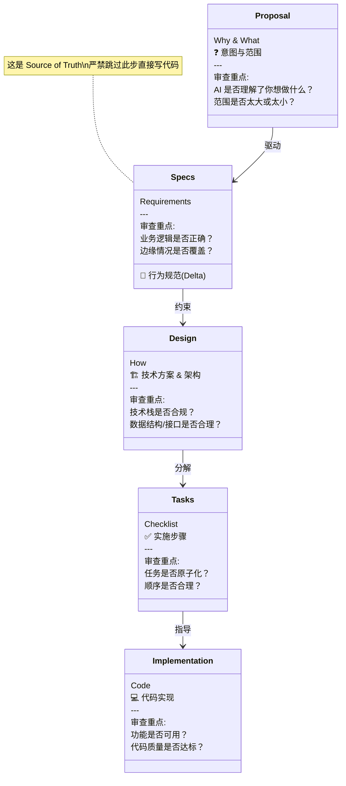

# Human in the Loop 可视化指南

本指南通过图表直观展示 OpenSpec 的 **Plan-First** 工作流以及人类开发者（你）的关键干涉点。

## 🎯 核心工作流与干涉点 (The Loop)

请遵循下图中的 **🛑 红色六边形** 节点，这是你必须停下来审查和决策的关键时刻。

```mermaid
graph TD
    %% 节点定义
    Start((开始)) 
    Idea["💡 提出想法/需求"]
    
    %% Proposal 阶段
    Proposal["📄 生成 Proposal.md"]
    Check1{"🛑 人类审查<br/>意图与范围"}
    
    %% Specs & Design 阶段
    SpecDesign["🏗️ 生成 Specs & Design"]
    Artifacts["📄 Specs/ <br/> 📄 Design.md"]
    Check2{"🛑 人类审查<br/>逻辑与技术方案<br/>(CRITICAL)"}
    
    %% Planning 阶段
    TaskPlan["📋 生成 Tasks"]
    Tasks["📄 Tasks.md"]
    Check3{"🛑 人类审查<br/>实施步骤"}
    
    %% Implementation 阶段
    Implement["💻 实施 & 验证"]
    Code["编写代码 & 测试"]
    Check4{"🛑 人类验收<br/>功能与质量"}
    
    %% End 阶段
    Archive["📦 归档 (Archive)"]
    End((完成))

    %% 流程连线
    Start --> Idea
    Idea --> |AI 生成| Proposal
    Proposal --> Check1
    
    Check1 --> |❌ 修改| Idea
    Check1 --> |✅ 批准| SpecDesign
    
    SpecDesign --> |AI 生成| Artifacts
    Artifacts --> Check2
    
    Check2 --> |❌ 修改| SpecDesign
    Check2 --> |✅ 批准| TaskPlan
    
    TaskPlan --> |AI 生成| Tasks
    Tasks --> Check3
    
    Check3 --> |❌ 修改| TaskPlan
    Check3 --> |✅ 批准| Implement
    
    Implement --> |AI 执行| Code
    Code --> Check4
    
    Check4 --> |❌ 修复| Implement
    Check4 --> |✅ 通过| Archive
    Archive --> End

    %% 样式定义
    style Check1 fill:#ffcccc,stroke:#cc0000,stroke-width:2px,color:#000
    style Check2 fill:#ffcccc,stroke:#cc0000,stroke-width:4px,color:#000
    style Check3 fill:#ffcccc,stroke:#cc0000,stroke-width:2px,color:#000
    style Check4 fill:#ffcccc,stroke:#cc0000,stroke-width:2px,color:#000
    style Artifacts fill:#e6f3ff,stroke:#0066cc,stroke-width:1px,color:#000
    style Proposal fill:#e6f3ff,stroke:#0066cc,stroke-width:1px,color:#000
    style Tasks fill:#e6f3ff,stroke:#0066cc,stroke-width:1px,color:#000
```

---

## 📄 工件 (Artifacts) 及其作用

OpenSpec 通过一系列工件逐步细化你的意图。每个工件都是上一阶段的产物，也是下一阶段的基础。

---

## 🚦 干涉时机速查表

| 阶段 | 工件 (Artifact) | 你的角色 | 审查重点 (Checklist) |
| :--- | :--- | :--- | :--- |
| **1. 提案** | `proposal.md` | **产品经理** | - [ ] 意图是否清晰？ - [ ] 范围 (Scope) 是否可控？ |
| **2. 设计** | `specs/`   `design.md` | **架构师** | - [ ] **(关键)** 逻辑是否严密？ - [ ] 技术选型是否批准？ - [ ] 接口定义是否清晰？ |
| **3. 计划** | `tasks.md` | **项目经理** | - [ ] 步骤是否足够细分？ - [ ] 是否包含测试步骤？ |
| **4. 实施** | `Code` | **技术主管** | - [ ] 代码风格是否一致？ - [ ] 是否引入了不必要的依赖？ - [ ] 测试是否通过？ |

**黄金法则：**
> **Stop & Confirm.**
> 永远不要让 AI 一口气跑完整个流程。在每个节点停下来，确认无误后再放行。
